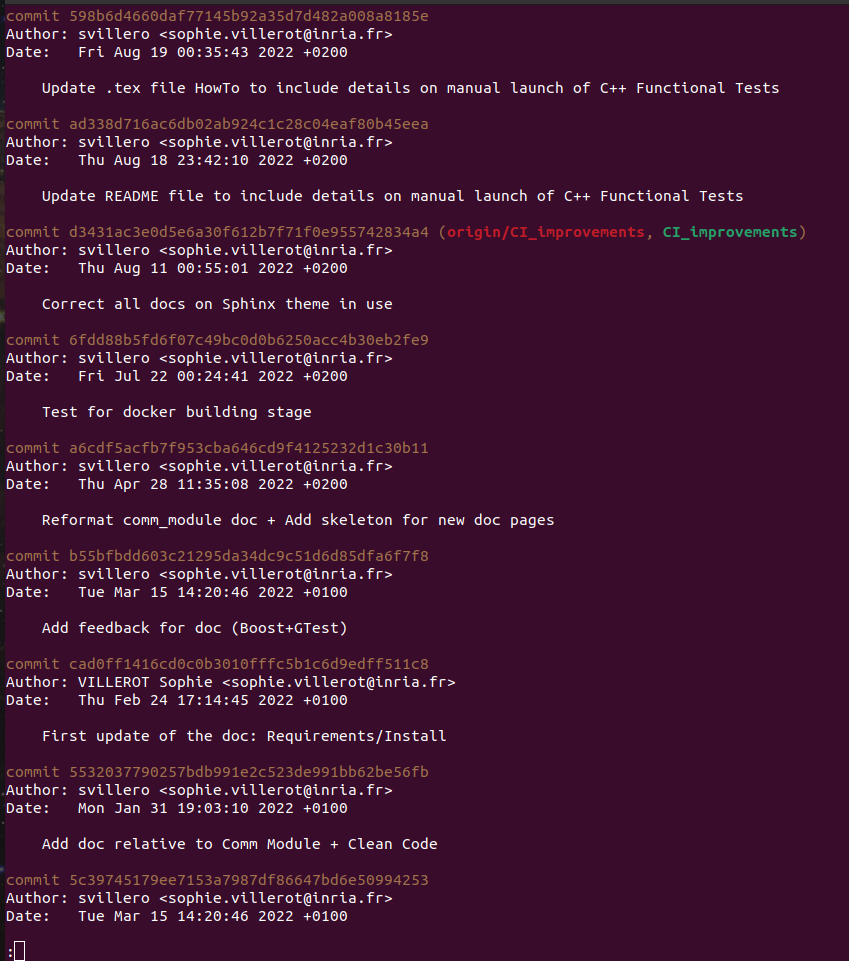

Git/Gitlab Mini-Guide
*********************

Finding a file and its commits updated through all branches
===========================================================

Depending on your search parameters, you can use the following command to find all commits related to the given file in `path/to/file`:

.. code-block:: console

  > git log --all --since="2 months ago" --until="2 weeks ago" -- path/to/file

where `--all` lists all branches and `since` and `until` defines the temporal window. Please refer to `git help log` for further options.
Use the command `q` for quit as with Vim to close the log and get back to the Terminal window.

Here is the prompt when searching modifications on the `README.md` file, and looking at all branches from the master branch:

If you know the commit id number, you can use:

.. code-block:: console

   > git branch --contains commit-id

Updating local repository with new commits (and managing new/deleted branches)
==============================================================================

Copying locally new remote branches
-----------------------------------

List all branches and fetch information on new ones with:

.. code-block:: console

  > git branch -a
  > git fetch -a

To fetch only one remote branch, git requires an explicit command-line:

.. code-block:: console

  > git checkout -b new_local_branch_name origin/new_remote_branch_name

To fetch all new branches that have been created remotely, without having to do it one by one:

.. code-block:: console

  > git branch -r | grep -v '\->' | sed "s,\x1B\[[0-9;]*[a-zA-Z],,g" | while read remote; do git branch --track "${remote#origin/}" "$remote"; done

After either the former or the later command, execute:

.. code-block:: console

  > git fetch -a
  > git pull -a

It should be noted that fetch will not update local branches (which track remote branches); pulling the branches is still necessary afterward.
Fetch will not create local branches (which track remote branches), it has to be done manually.

Removing local branches that have been remotely deleted
-------------------------------------------------------

First, ensure that you are on the master branch:

.. code-block:: console

  > git checkout master

Fetch all changes brought to the branches re-organisation with:

.. code-block:: console

  > git fetch --prune

Delete the local branches that have already been removed remotely with:

.. code-block:: console

  > git branch -d [list of branches to remove]

Beware that the capital `-D` option is used to remove *remote* branches (that are stored locally).

To delete a remote branch on the remote depot, use:

.. code-block:: console

  > git push origin -d branch-name