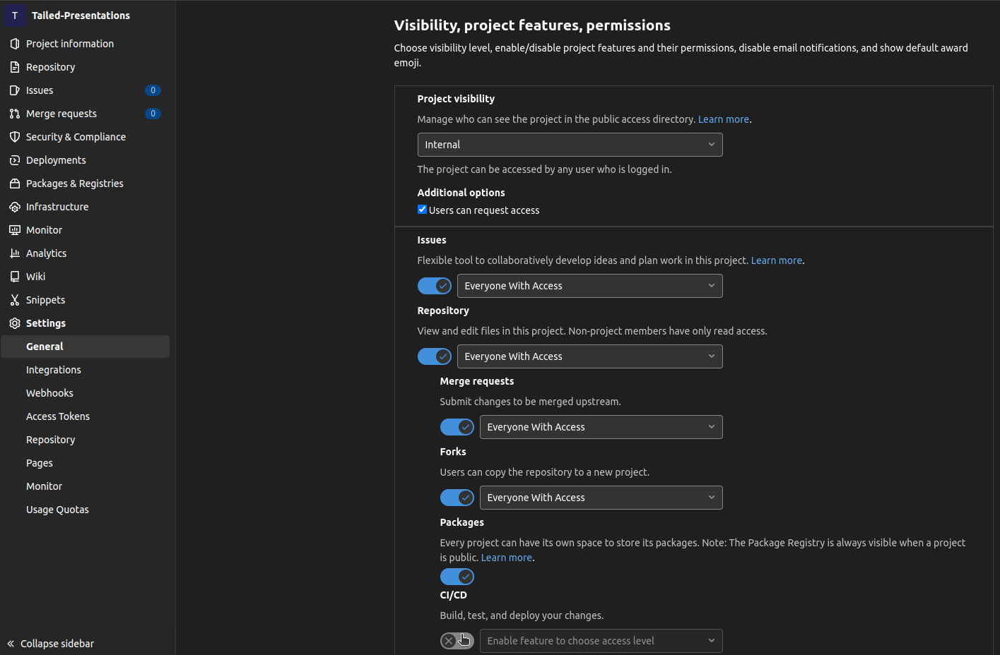
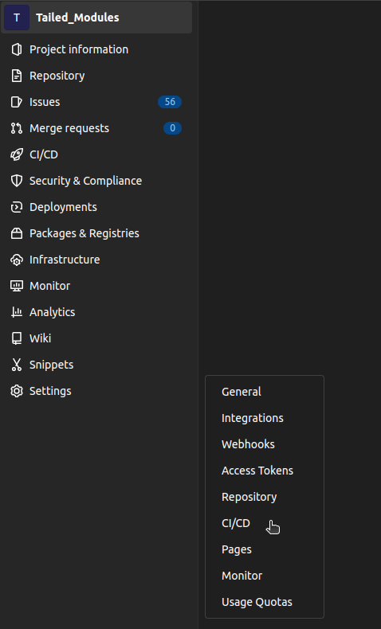
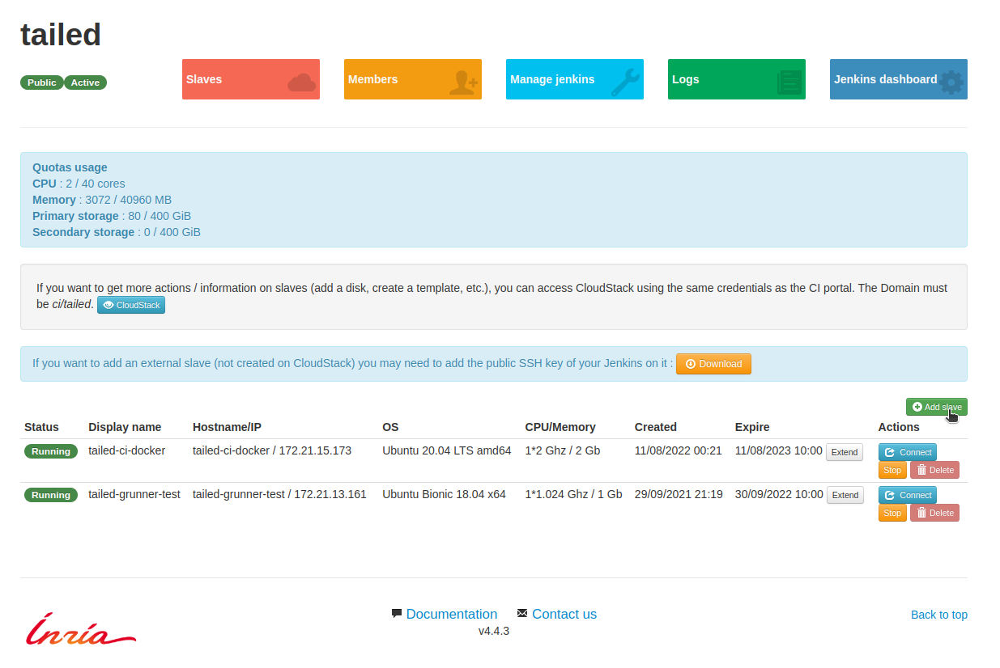
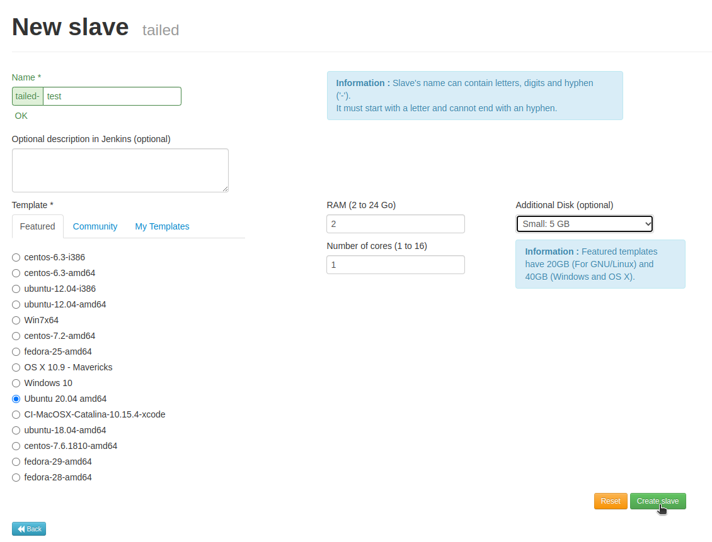

Developers' Protocols
*********************

Rebasing and Submitting a merge request
=======================================

Rebasing
--------

In order to smooth the timeline of the commits between branches and avoid the dreaded merge,
it has been decided to enforce the **use of rebase before merge**.

In this example, the goal is to merge with master. All modifications have been committed in the `branch_to_merge`.
However, the `master` branch may have been updated while this feature branch was cared for.
Now that `branch_to_merge` is ready, the rebase can be undergone:

.. code-block:: console

  > git checkout branch_to_merge
  > git rebase master

If there are conflicts during the rebase, files will appear listed as modified yet not committed:

.. code-block:: console

  > git status

The following steps should be repeated until there is no more conflict:

.. code-block:: console

  > git add/rm files_to_correct
  > git rebase --continue

Once all conflicts have been resolved, the rebase is done locally.
It needs to be pushed by force onto the remote branch:

.. code-block:: console

  > git push -f

The history of commits is thus rewritten into the remote branch,
by incorporating smoothly commits that have been done in parallel in the master branch.

Making a merge request
----------------------

Using the command line in a Terminal window
^^^^^^^^^^^^^^^^^^^^^^^^^^^^^^^^^^^^^^^^^^^

Using Gitlab's GUI
^^^^^^^^^^^^^^^^^^

Reviewing a merge request
-------------------------

Look for comments like #TODO

Accepting a merge request
-------------------------

Implementation of the CI on Gitlab: A quick summary
===================================================

The instructions dictating the behavior of the CI pipelines (all branches included) is described in the file called `.gitlab-ci.yml`.
This file ought to be placed at the root of the repository.

See more details: https://gitlab.inria.fr/siteadmin/doc/-/wikis/faq#faq-frequently-asked-questions

Enabling the CI/CD pipelines on a repository
--------------------------------------------

In the repository's "settings", under the "General" Permissions tab, in the the "Visibility, project features, permissions" menu,
the "CI/CD" menu needs to be enable (do not forget to click on Save changes):

Then a "CI/CD" tab should now appears in the settings:

In this "CI/CD" tab, further details, that will be required here, can be found
(such as the url and the registration token, when adding a specific runner).

Creating the CI virtual machine
-------------------------------

An account registered on the website ci-inria.fr is required for the following steps.

On the page of the project, click the button "Add Slave":

And then choose the desired features regarding OS, memory and additional disk on the appearing page:

Once you are satisfied with the settings, click on the button "Create Slave"
and your new CI slave should appear soon in the project listing.

See more details: https://ci.inria.fr/doc/page/slaves_access_tutorial/

Creating a Gitlab Runner
------------------------

- connecting through SSH to the virtual machine: https://ci.inria.fr/doc/page/slaves_access_tutorial/#connecting-to-a-linuxmacosxwindows-10-slave-through-ssh

- installing the gitlab runner via Docker: https://docs.gitlab.com/runner/install/

- registering the runner: https://docs.gitlab.com/runner/register/

Connecting the Runner to the CI/CD pipeline
-------------------------------------------

- See: https://ci.inria.fr/doc/page/gitlab/

Writing the .yaml file
----------------------

- creation: https://docs.gitlab.com/ee/ci/yaml/gitlab_ci_yaml.html

- editor + lint: https://docs.gitlab.com/ee/ci/pipeline_editor/

Creating a documentation step in the pipeline
---------------------------------------------

Creating test steps in the pipeline
-----------------------------------

- artifact reports: https://docs.gitlab.com/ee/ci/yaml/artifacts_reports.html
